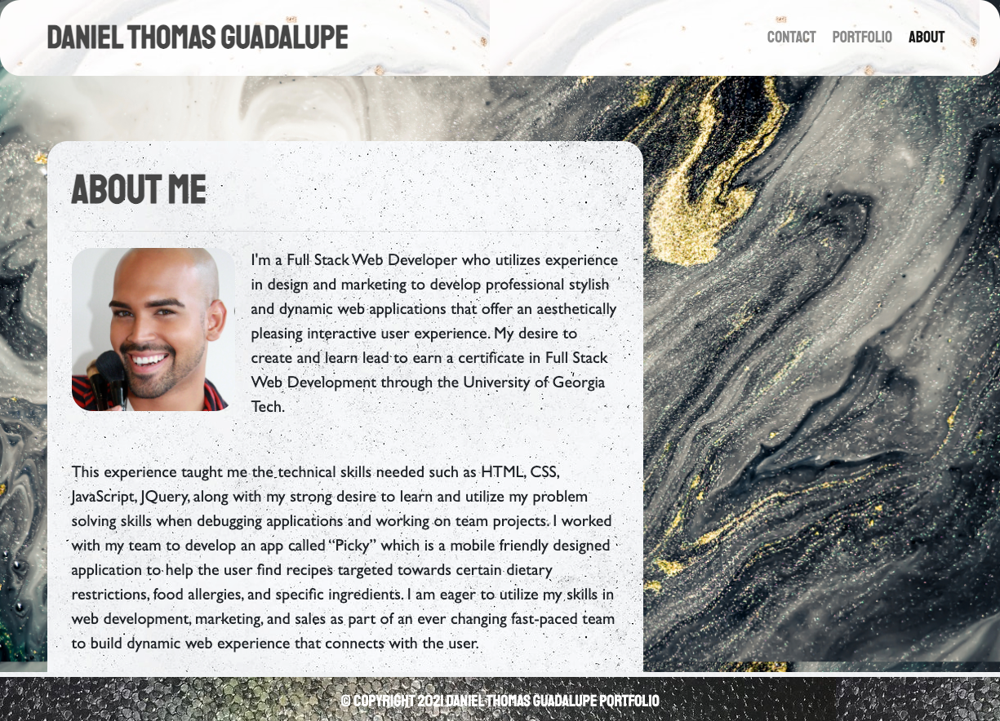
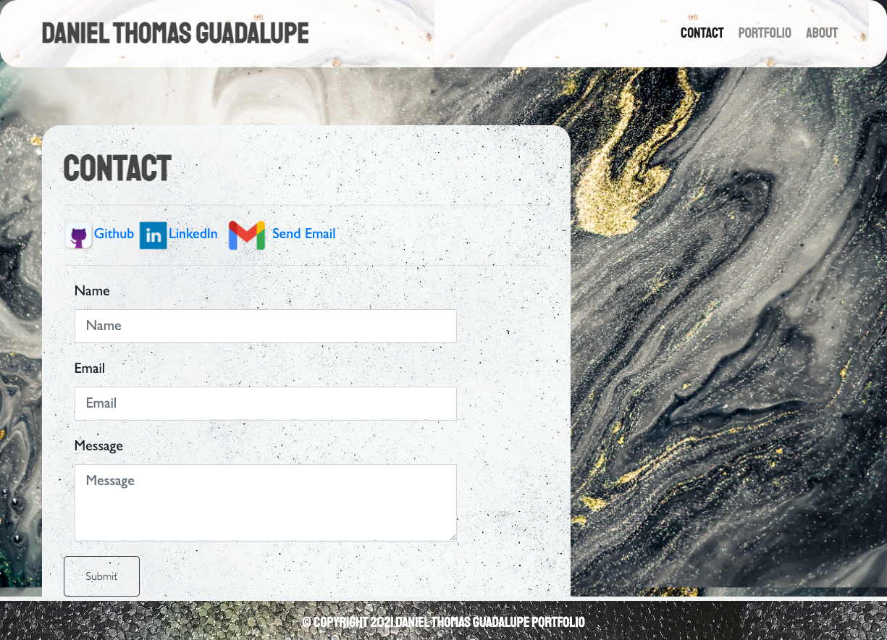
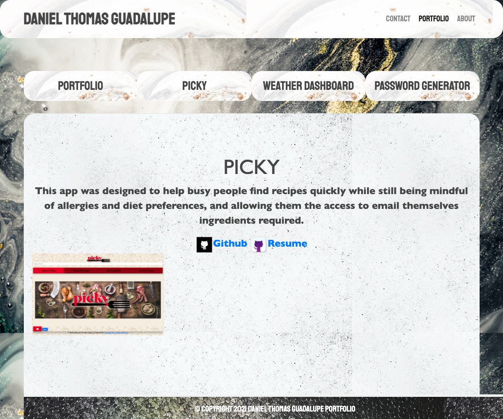

## DTG-Portfolio-2021

**This is a simple calendar application that allows a user to save events for each hour of the day by modifying starter code. This app will run in the browser and feature dynamically updated HTML and CSS powered by jQuery using the [Moment.js](https://momentjs.com/) library to work with dates and times. **

## Requirements

* Submit an updated portfolio featuring Project 1 and two exemplary homework assignments.

* Submit an updated GitHub profile with pinned repositories featuring Project 1 and two exemplary assignments.

* Submit an updated resume

* Submit an updated LinkedIn profile
## SCREENSHOTS

The following animation demonstrates the application functionality:

## Instructions

1. [Updated Portfolio](https://danielthomas129.github.io/DTG-Portfolio-2021/)
2. [GitHub Profile](https://github.com/danielthomas129)
3. [Updated Resume](#updated-resume)
4. [Updated LinkedIn](https://linkedin.com/in/danieltguadalupe)
## GitHub Repository & Deployed Site

[Click here to view published site] or (https://danielthomas129.github.io/DTG-Portfolio-2021/)

[Click here to view Github Repository] or (https://github.com/danielthomas129/DTG-Portfolio-2021)
- - -

### Daniel Thomas Guadalupe

© 2020 Trilogy Education Services, a 2U, Inc. brand. All Rights Reserved.
